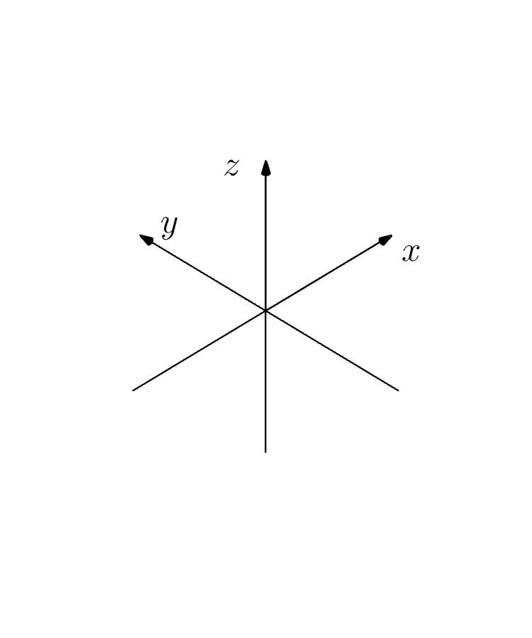

# Cartesian coordinate system

The **Cartesian coordinate system** allows us to represent things with a maximum dimension of 3. 

Let's suppose we have an apple floating in a room, _the one that crashed into Newton's head and invented gravity for example_. If you measure the distance between the apple and the wall on the right, the wall on the back, and the floor, it's possible to represent the apple in a cartesian 3D space. 

We humans live in a 3D world after all, so it would only make sense to represent the apple in the same dimensions.

Let's assign the measurements to coordinates.

Each coordinate would be represented in the axis. **By** **norm**, we use the letters **x, y,** and **z** to represent the different axis, just like the gif above and the apple would be represented as a single adimensional point: \(a,b,c\) being the a, b, and c the different measurements.

You can play around with the **CodePen** below, hit run, and plot the apple! 😃 



